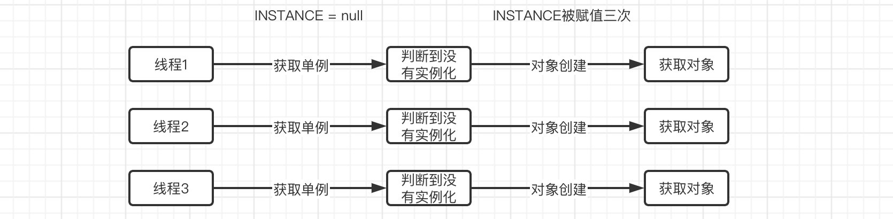

### 介绍

单例模式（Singleton Pattern）是 Java 中最简单的设计模式之一。这种类型的设计模式属于创建型模式，它提供了一种创建对象的最佳方式。

这种模式涉及到一个单一的类，该类负责创建自己的对象，同时确保只有单个对象被创建。这个类提供了一种访问其唯一的对象的方式，可以直接访问，不需要实例化该类的对象。

### 意图

保证一个类仅有一个实例，并提供一个访问它的全局访问点。

### 主要解决

一个全局使用的类频繁地创建与销毁。

### 何时使用

当您想控制实例数目，节省系统资源的时候。

### 如何实现

判断系统是否已经有这个单例，如果有则返回，如果没有则创建。

### 注意事项

getInstance() 方法中需要使用同步锁 synchronized (Singleton.class) 防止多线程同时进入造成 instance 被多次实例化。

### 优点

1、在内存里只有一个实例，减少了内存的开销，尤其是频繁的创建和销毁实例（比如管理学院首页页面缓存）。

2、避免对资源的多重占用（比如写文件操作）。

### 缺点

没有接口，不能继承，与单一职责原则冲突，一个类应该只关心内部逻辑，而不关心外面怎么样来实例化。

### 示例场景

