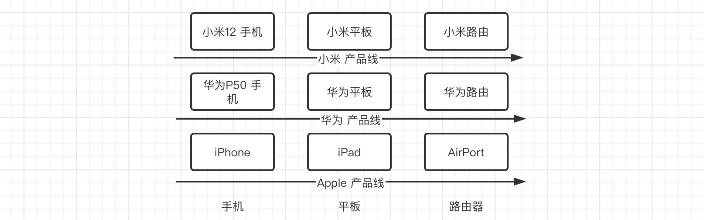

### 抽象工厂模式

前面我们介绍了工厂方法模式，通过定义顶层抽象工厂类，通过继承的方式，针对于每一个产品都提供一个工厂类用于创建。

不过这种模式只适用于简单对象，当我们需要生产许多个产品族的时候，这种模式就有点乏力了，比如：



实际上这些产品都是成族出现的，比如小米的产品线上有小米12，小米平板等，华为的产品线上也有华为手机、华为平板，但是如果按照我们之前工厂方法模式来进行设计，那就需要单独设计9个工厂来生产上面这些产品，显然这样就比较浪费时间的。

但是现在有什么方法能够更好地处理这种情况呢？我们就可以使用抽象工厂模式，我们可以将多个产品，都放在一个工厂中进行生成，按不同的产品族进行划分，比如小米，那么我就可以安排一个小米工厂，而这个工厂里面就可以生产整条产品线上的内容，包括小米手机、小米平板、小米路由等。

所以，我们只需要建立一个抽象工厂即可：

```java
public class Router {
}
```

```java
public class Table {
}
```

```java
public class Phone {
}
```

```java
public abstract class AbstractFactory {
    public abstract Phone getPhone();

    public abstract Table getTable();

    public abstract Router getRouter();
}
```

一个工厂可以生产同一个产品族的所有产品，这样按族进行分类，显然比之前的工厂方法模式更好。

不过，缺点还是有的，如果产品族新增了产品，那么我就不得不去为每一个产品族的工厂都去添加新产品的生产方法，违背了开闭原则。